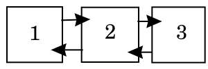

# Oppgave 1: koblede lister

Dobbelt koblede lister viste seg å ikke være trivielt å implementere i Rust, på grunn av enkelte aspekter ved Rusts minnehåndtering og type-system. Rust har et sterkt konsept om eierskap, som betyr at kun en variabel kan eie en verdi til enhver tid, andre variabler kan kun "låne" den samme verdien innen et gitt scope og eierskap gis tilbake til den originale eieren når variabelen som lånte verdien går ut av scope.

Dette fører raskt til problemer når man skal lage en koblet liste. La oss tenke på denne enkle koblede listen med tre elementer:

{height=10%}

I denne listen inneholder både element 1 og element 3 pekere til element 2. Hvem av dem skal eie det? Om 1 eier 2 kan ikke 3 ha noen peker til 2, siden et slikt lån av 2 lån må ha et gitt scope og både 1 og 3 lever på heapen uten noen enkel scope eller levetid.

Dette lar seg heldigvis løse ved hjelp av Rusts `unsafe`, som skrur av Rust-funksjonalitet som eierskap/lån innenfor en kode-blokk eller et scope. For å være sikker på at jeg holder tunga rett i munnen ved konvertering av pekere mellom Rusts `Box<T>`/`NonNull<T>` til bruk i vanlig kode og vanlige pekere inne i `unsafe`-blokker har jeg måttet ta inspirasjon fra implementasjonen av koblede lister i Rusts standardbibliotek, `std::collections::LinkedList`^[[https://doc.rust-lang.org/src/alloc/collections/linked_list.rs.html#50-55]()]. Den ferdige implementasjonen er likefullt original og har spesifikk funksjonalitet spesifikt for å representere lange tall som ikke ville gitt mening i en generell koblet liste, som å summere eller subtrahere to lister fra hverandre. For leselighetens del har jeg valgt å kalle liste-objektet mitt `Tall` og node-objektet mitt `Siffer` i implementasjonen.

Som vist i eksempelet i oppgaveteksten tar min versjon av programmet inn et regnestykke fra terminalen, og gir en utskrift av utregningen og resultatet

Pluss:
```
    > ./langetall 10000000000000299999994892 + 729567
    10000000000000299999994892
    +                     729567
    = 10000000000000300000724459
```

Minus:
```
    > ./langetall 840000000000000200000 - 10000000000700284387
    840000000000000200000
    -  10000000000700284387
    = 829999999999299915613
```
(Subtraksjon som ville gitt negativt resultat er ikke tatt høyde for, da datastrukturen kun kan håndtere positive tall)

# Oppgave 2: binært søketre

I motsetning til den forrige oppgaven har ikke de fleste tre-strukturer de samme problemene som dobbelt koblede lister når man skal implementere dem i Rust, takk og pris.

I oppgaven håndteres det kun trær med et ord på hver node, men jeg valgte å implementere treet mitt med generiske elementer, med noen restriksjoner på typene som kan oppbevares

```rust
    enum Node<T: Ord + Display + Clone> {
        ...
    }
```

Her vil `<T: Ord + Display + Clone>` si at denne `Node`-typen kan oppbevare alle typer `T` som implementerer `Ord` (operatorene <, >, <= og >= og metoden `a.cmp(b)` for å sammenligne to verdier `a` og `b`), `Display` (kan skrives ut med `print!()`) og `Clone` (kan trivielt kopieres). Spesielt `Ord` er viktig for et binært søketre, siden verdiene på noder i treet må sammenlignes med hverandre for å kunne plassere nye noder.

Å sette inn nye verdier i treet kan så løses ved å rekursivt vandre gjennom treet og sammenligne den nye verdien med eksisterende noder, gå venstre om den nye verdien er mindre enn den eksisterende og gå til høyre om den nye verdien er høyere. Når denne prosessen leder frem til en tom node settes den nye verdien inn på plassen sin, og om verdien allerede eksisterer i treet forkastes den nye verdien for å unngå duplikat-noder.

```rust
    pub fn sett_inn(&mut self, ny_verdi: T) -> () {
        match self {
            Self::Node {
                verdi,
                venstre,
                høyre,
            } => match ny_verdi.cmp(verdi) {
                Ordering::Less => venstre.sett_inn(ny_verdi),
                Ordering::Greater => høyre.sett_inn(ny_verdi),
                Ordering::Equal => return,
            },
            Self::Tom => *self = Node::ny_node(ny_verdi),
        }
    }
```

Siden dette er et binært søketre er dataen i treet alltid sortert når man leser den fra venstre til høyre, så dataen kan også trivielt hentes ut i sortert rekkefølge

```rust
    pub fn som_liste(&self) -> Vec<T> {
        let mut buffer = Vec::<T>::new();

        match self {
            Self::Tom => {}
            Self::Node {
                verdi,
                venstre,
                høyre,
            } => {
                buffer.append(&mut venstre.som_liste());
                buffer.push(verdi.clone());
                buffer.append(&mut høyre.som_liste());
            }
        }

        buffer
    }
```

Utskrift av treet oppnås ved å iterere gjennom dataen på samme måte som et bredde-først-søk hvor det for hvert lag av treet itereres gjennom alle nodene i laget der de skrives ut til terminalen, og alle under-nodene til hver node legges til en kø som så tas gjennom samme prosess med utskrift og henting av under-noder. Det å bruke en kø-struktur sikrer at nodene skrives ut i samme rekkefølge som de ble lagt inn i køen, heller enn en vanlig `Vec<T>` som både legger til og henter ut elementer på slutten av listen.

Alt i alt gir dette tre-struktur og utskrift som følger

```
    > ./søketre hode bein hals arm tann hånd tå hake legg albue
    Sortert: ["albue", "arm", "bein", "hake", "hals", "hode",
    "hånd", "legg", "tann", "tå"]
    Treet:
                                hode                              
                bein                            tann              
        arm             hals            hånd             tå       
    albue            hake                    legg
```
