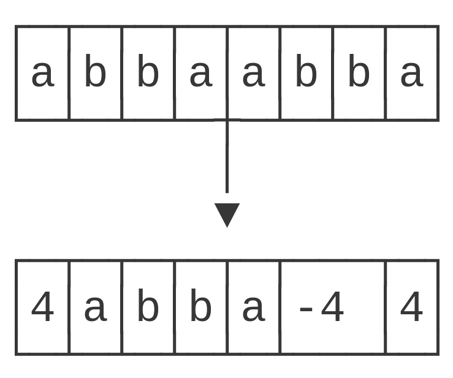
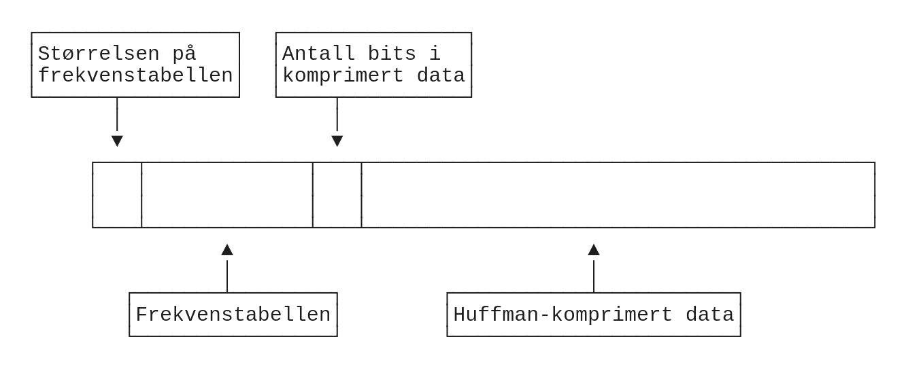

# Lempel-Ziv

## Komprimering

Jeg har valgt å implementere den enkelste varianten av Lempel-Zivs komprimeringsalgoritme, LZ77. Implementasjonen er basert på beskrivelsen gitt i forelesningene, der data er fordelt i komprimerte og ukomprimerte blokker som er markert med en indikator. Indikatoren er i min implementasjon et 16 bits heltall med fortegn, der en positiv indikator betyr at dataen som følger er ukomprimert, og en negativ indikator representerer en bakover-referanse i dataen (komprimert blokk). Dersom indikatoren er negativ tolkes påfølgende byte som antallet bytes som skal hentes fra bakover-referansen, som gir en maksimal lengde på en referanse på 255 bytes. Bruken av 16 bits som indikator gjør at lengste mulige ukomprimerte blokk, og lengste mulige bakover-referanse, er 32kB.

Dette designet gjør at en bakover-referanse tar totalt tre bytes, og det er dermed ikke noe poeng å opprette en bakover-referanse som er kortere enn tre bytes. Å bytte ut to bytes data med tre bytes referanse gir ingen komprimering! Minste mulige data der denne algoritmen faktisk har noen effekt vil dermed være tilfellet der data består av en sekvens på fire bytes som forekommer to ganger.

{width=40%}

Bakover-søket etter mulig lik data som kan erstattes med en bakover-referanse er implementert som et naivt byte-for-byte søk. Dette er ikke veldig effektivt, men med dataene som er lagt ved oppgaven er hastigheten likevel akseptabel. Kjøring av kun Lempel-Ziv på egen maskin gir total kjøretid på omtrent 21 sekunder på den største vedlagte filen.

```
> time ./lz -k enwik8
./lz -k enwik8  21.46s user 0.11s system 99% cpu 21.640 total
```

## Dekomprimering

De fleste detaljene av dekomprimering følger logisk fra hvordan komprimering er implementert. Dekomprimerings-rutinen leser seg fra indikator til indikator i den komprimerte dataen, og behandler ukomprimerte blokker ved å kopiere dem direkte til output mens tilbake-referanser behandles ved å lese seg tilbake i den dekomprimerte dataen og kopiere korrekt mengde data derfra til å dereferere tilbake-referansen.

\begin{figure}
\begin{minipage}[t]{.4\linewidth}
\includegraphics[width=\linewidth]{illustrasjon/lz_dekomp_1.png}
\caption{Første referanse i komprimert data leses}
\end{minipage}\hfill\vrule\hfill
\begin{minipage}[t]{.4\linewidth}
\includegraphics[width=\linewidth]{illustrasjon/lz_dekomp_2.png}
\caption{Angitt antall bytes kopieres fra komprimert data til output}
\end{minipage}
\hrule
\begin{minipage}[t]{.4\linewidth}
\includegraphics[width=\linewidth]{illustrasjon/lz_dekomp_3.png}
\caption{Neste referanse leses, angitt sted å kopiere fra i output finnes}
\end{minipage}\hfill\vrule\hfill
\begin{minipage}[t]{.4\linewidth}
\includegraphics[width=\linewidth]{illustrasjon/lz_dekomp_4.png}
\caption{Angitt antall bytes kopieres til slutten av output, og dekomprimeringen er ferdig}
\end{minipage}
\end{figure}

# Huffman-koding

## Komprimering

Huffman-koding er en komprimeringsalgoritme spesifikt utviklet for å komprimere tekst, som jeg har implementert for å kunne forsøke å komprimere hvilken som helst serie av bytes. Implementasjonen min oppretter en frekvenstabell ved å lineært lese gjennom den angitte dataen byte for byte og øke frekvensen til enhver gitt byte i tabellen etterhvert som de observeres. Bytes som ikke forekommer i en fil forekommer heller ikke i frekvenstabellen eller Huffman-treet, for å holde størrelsen så liten som mulig. Frekvenstabellen plasseres på starten av den komprimerte dataen, da denne kan brukes for å gjenskape Huffman-treet til dataen slik at den kan dekodes. For å vite når dataen som representerer frekvenstabellen tar slutt og den Huffman-kodede dataen begynner lagres også størrelsen på frekvenstabellen. Den totale datastrukturen i Huffman-kodet data blir dermed som vist under.



Det at Huffman-koding er utviklet for å komprimere tekst viser seg å også bety at algoritmen er heller dårlig egnet til å komprimere enkelte andre typer data. Dette kan observeres ved å Huffman-kode et PDF-dokument:
```
> ./huffman -k diverse.pdf
Leste 156671 bytes fra diverse.pdf
Skrev 156214 bytes til diverse.pdf.huff
```

En kikk i starten av denne filen viser at frekvenstabellen inneholder alle 256 forskjellige bytes fra 0x00 til 0xFF. Frekvens er lagret som et 32-bits heltall, så totalstørrelsen til denne tabellen i den komprimerte filen er $5 \text{ bytes}\cdot 256 = 1280 \text{ bytes}$. Dette er en betydelig mengde data, men kun en hundredel av den totale filstørrelsen. Den viktigere faktoren er størrelsen på Huffman-treet i dette tilfellet. Om vi for enkelhets skyld ser for oss et Huffman-tre med 256 løvnoder der alle løvnoder har samme frekvens vil dette treet være ekvivalent med et komplett binærtre der første "lag" har en rotnode, andre "lag" har to noder, tredje "lag" har fire noder, videre ned til vi først etter ni lag kommer ned til de 256 løvnodene. Det vil si at det tar åtte steg å traversere fra rota av treet til hvilken som helst løvnode, og Huffman-koding ved hjelp av dette treet gjør at hver byte kodes om til åtte bits og _ingen_ komprimering skjer! I praksis vil Huffman-treet være fordelt slik at noen noder har kortere vei og noen noder har lengre vei, men det følger likefullt at Huffman er en utrolig lite effektiv algoritme for å komprimere denne typen data.

Algoritmen fungerer betydelig bedre på tekstfiler, for eksempel klarer den krympe sin egen kildekode med 40%:

```
> ./huffman -k huffman.rs
Leste 9396 bytes fra huffman.rs
Skrev 5646 bytes til huffman.rs.huff
```

## Dekomprimering

Som med Lempel-Ziv følger dekomprimering logisk fra hvordan komprimering er implementert. Frekvens-tabellen leses fra starten av den komprimerte dataen og brukes til å rekonstruere Huffman-treet. Den resterende dataen leses så bit for bit, det rekonstruerte treet traverseres og hver gang en løvnode nås blir byten representert i denne noden plassert i output og traverseringen av treet hopper tilbake til rot-noden. Gjennom denne prosessen holdes det telling på nøyaktig antall bits som er prosessert, da det ikke er sikkert at den komprimerte dataen passer nøyaktig inn i et antall bytes og dekomprimeringen mest sannsynlig vil måtte avsluttes halvveis inn i en byte. De siste bits i den siste byten vil kun inneholde et antall 0, som vil kunne dekodes feilaktig og gi "ekstra" data på slutten av en dekomprimert fil.
